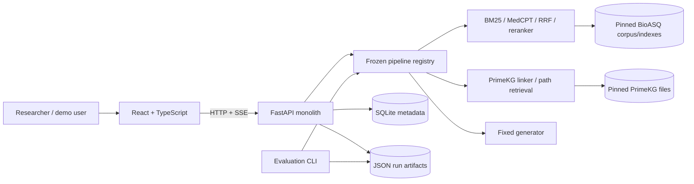
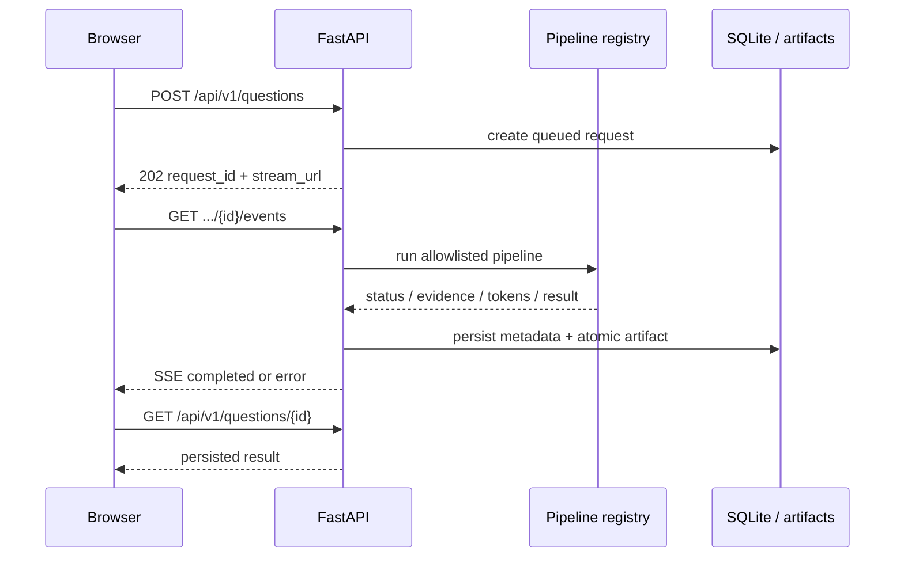

# Medical Graph-RAG architecture

Status: proposed for implementation. The frozen research protocol in `KE_HOACH_NGHIEN_CUU_MedicalGraphRAG.html` remains authoritative.

## Goals

- Answer an English medical question with text and traceable evidence.
- Run B0–G2 through one pipeline contract so experiments and the demo use identical code.
- Persist enough provenance to replay evaluation without calling a model.
- Keep the five-week build local and boring: one FastAPI process, one React app, SQLite, files.

## System context

## Runtime flow

## Components and boundaries

| Component | Owns | Must not own |
|---|---|---|
| Frontend | input, pipeline selection, stream state, safe evidence rendering | prompts, model credentials, retrieval logic |
| API | validation, request lifecycle, SSE, cancellation, readiness | experimental metric decisions |
| Pipeline registry | immutable B0–G2 composition and config hashes | arbitrary client configuration |
| Text retrieval | BM25/MedCPT retrieval, fusion, reranking | answer generation |
| Graph retrieval | entity links, constrained 1–2 hop paths, provenance | invented edges or clinical citations |
| Generator | answer and citation markers from supplied evidence | fetching data directly |
| Artifact store | raw inputs/outputs/timing/provenance | mutable derived conclusions |
| Evaluator | replay, metrics, statistics, reports | production request handling |

Dependency direction is `UI -> API -> pipeline -> retrieval/generation`. Evaluation calls the same pipeline boundary or replays artifacts. Retrieval modules never import the API or frontend.

## Pipeline registry

The browser sends only a pipeline ID. Server configuration defines the implementation.

| ID | Composition |
|---|---|
| B0 | generator only |
| B1 | BM25 + generator |
| B2 | MedCPT dense + generator |
| B3 | BM25 + MedCPT + RRF + reranker + generator |
| G1 | PrimeKG retrieval + generator |
| G2 | B3 evidence + PrimeKG evidence + fixed-budget fusion + generator |

Each result records pipeline/config/prompt/model/data/KG revisions and hashes. B3 and G2 must use the same generator, prompt family, test questions and evidence budget.

## Persistence and failure semantics

- SQLite stores request identity, state, timestamps and artifact path.
- JSON artifacts store question, evidence, raw answer, citation map, timings and provenance.
- Write artifacts to a temporary file and atomically rename before marking a request completed.
- On restart, queued/running requests become `failed` with `SERVER_RESTARTED`; completed results remain readable.
- One Uvicorn worker owns an in-process task registry and concurrency semaphore. A queue is explicitly out of scope.
- Demo and frozen experiments use separate artifact namespaces.

## Security and safety

- Bind locally by default; use an explicit CORS allowlist.
- Read secrets only from environment variables and never return stack traces or keys.
- Reject unknown request fields, unknown pipeline IDs and questions outside 1–2000 characters.
- Render only validated PubMed URLs. PrimeKG paths are structured evidence, not PubMed citations.
- Never render model-produced HTML. Always show the research-prototype warning.
- No EHR upload, authentication, payment, patient profile or clinical deployment.

## Deployment

Development uses two processes: Vite and one Uvicorn worker. The simplest distributable build serves the compiled frontend as static files from FastAPI. Add containers only if another machine must reproduce environment setup.

