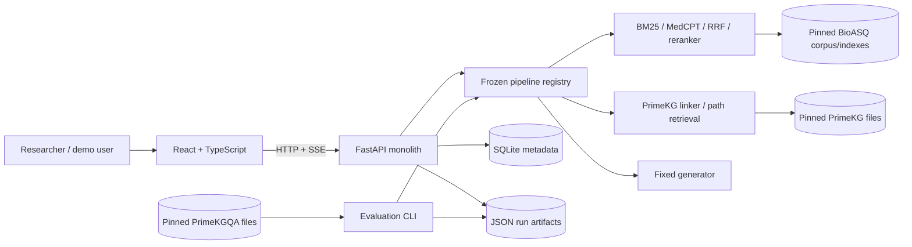
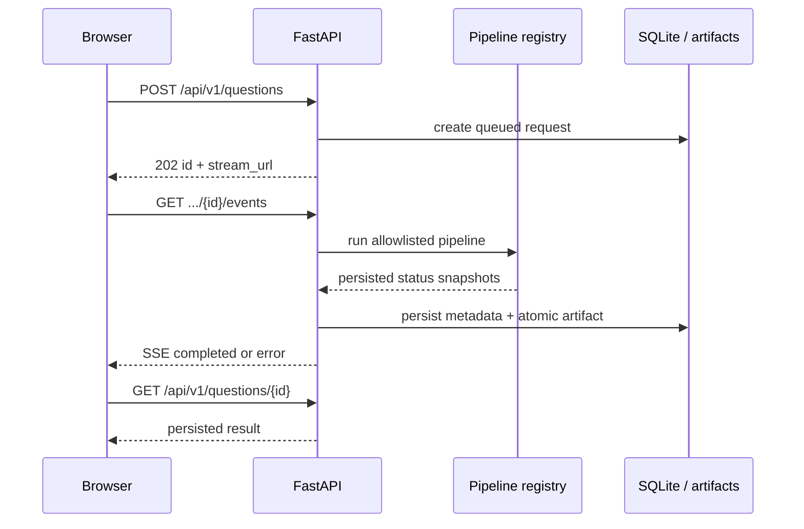

# Medical Graph-RAG architecture

Status: local product and component experiments are implemented and real-data tested; E5-v2 dev and locked/human stages are reported separately in `docs/RESULTS.md`. “Implemented” never implies answer-quality validation.

## Goals

- Answer an English medical question with text and traceable evidence.
- Run B0–G2 through one pipeline contract so experiments and the demo use identical code.
- Persist evidence and generation artifacts so answer evaluation can replay without recalling the generator; a non-cached machine judge still makes external calls.
- Keep the five-week build local and boring: one FastAPI process, one React app, SQLite, files.

## System context

## Runtime flow

## Components and boundaries

| Component | Owns | Must not own |
|---|---|---|
| Frontend | input, pipeline selection, stream state, safe evidence rendering | prompts, model credentials, retrieval logic |
| API | validation, request lifecycle, SSE, cancellation, readiness | experimental metric decisions |
| Pipeline registry | immutable B0–G2 composition and config hashes | arbitrary client configuration |
| Text retrieval | BM25/MedCPT retrieval, fusion, reranking | answer generation |
| Graph retrieval | entity/relation links, BioASQ 1–2 hop paths, PrimeKGQA up-to-3-hop component runs, provenance | invented edges or clinical citations |
| Generator | answer and citation markers from supplied evidence | fetching data directly |
| Artifact store | raw inputs/outputs/timing/provenance | mutable derived conclusions |
| Evaluator | replay, metrics, statistics, reports | production request handling |

Dependency direction is `UI -> API -> pipeline -> retrieval/generation`. Evaluation calls the same pipeline boundary or replays artifacts. Retrieval modules never import the API or frontend.

## Pipeline registry

The browser sends only a pipeline ID. Server configuration defines the implementation.

| ID | Composition |
|---|---|
| B0 | generator only |
| B1 | BM25 + generator |
| B2 | MedCPT dense + generator |
| B3 | BM25 + MedCPT + RRF + reranker + generator |
| G1 | PrimeKG retrieval + generator |
| G2 | B3 evidence + PrimeKG evidence + fixed-budget fusion + generator |

Each frozen run records pipeline/config/prompt/model/data/population and index fingerprints. B3/G2/X1/X2 use the same generator, prompt family, test questions and per-question whitespace-word budget.

## Evaluation tracks

| Track | Data | Purpose | Primary metrics |
|---|---|---|---|
| End-to-end | BioASQ `question-answer-passages` + `text-corpus` | Compare frozen B3 with G2 | Human paired correctness 0–2; calibrated full-set judge; citation metrics |
| Graph component | PrimeKGQA release + pinned PrimeKG tables | Descriptive linking/path-pattern fallback | Answer-set EM/F1, path-return and structural checks by 2/3/4-node; execution accuracy N/A |

PrimeKG is the graph being queried; PrimeKGQA is a QA benchmark generated from it. The required 99% compatibility gate reached only 3%, so current PrimeKGQA results are normalized-pattern fallback metrics and cannot support executable-query claims.

## Persistence and failure semantics

- SQLite stores request identity, question, lifecycle state, timestamps and the result JSON used by the API.
- Atomic JSON artifacts store a job envelope (`id`, question, pipeline, timestamps) plus evidence, answer, citation map, timings and provenance.
- Write artifacts to a temporary file and atomically rename before marking a request completed.
- On restart, queued/running requests become `failed` with `SERVER_RESTARTED`; completed results remain readable.
- One Uvicorn worker owns an in-process task registry and concurrency semaphore. A queue is explicitly out of scope.
- Demo and frozen experiments use separate artifact namespaces.

## Security and safety

- Bind locally by default; use an explicit CORS allowlist.
- Read secrets only from environment variables and never return stack traces, provider messages or keys; server-side exception traces stay in local logs.
- Reject unknown request fields, unknown pipeline IDs and questions outside 3–2000 characters.
- Render only validated PubMed URLs. PrimeKG paths are structured evidence, not PubMed citations.
- Never render model-produced HTML. Always show the research-prototype warning.
- No EHR upload, authentication, payment, patient profile or clinical deployment.

## Deployment

Development uses two processes: Vite and one Uvicorn worker. The simplest distributable build serves the compiled frontend as static files from FastAPI. Add containers only if another machine must reproduce environment setup.
