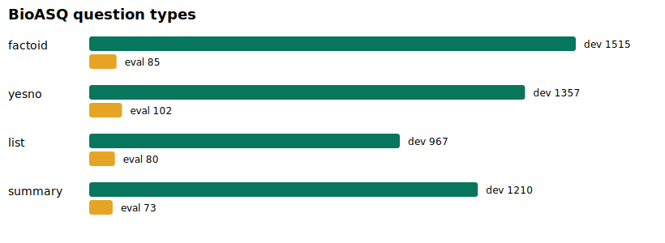

# Reproducible experiment report

All numbers below come from committed manifests whose detailed per-question artifacts are gitignored. Seed is 20260712. “Recall@10” is the mean fraction of all gold PMIDs recovered per question, not hit-rate.

## Data and integrity

| Resource | Actual data used |
|---|---:|
| BioASQ corpus / dev / locked eval | 49,513 / 5,049 / 340 |
| PrimeKG nodes / directed edges | 129,375 / 8,100,498 |
| PrimeKGQA train / val / test | 51,220 / 17,074 / 17,074 |

BioASQ dev/eval have no exact or ≥0.90 token-Jaccard question overlap. Gold-PMID corpus coverage is 0.999802 on dev and 1.0 on eval. MedCPT would truncate 2,232 corpus records (4.5079%) at 512 tokens. PrimeKG is one connected component, but the distributed edge table has no row-level provenance field; only release-level provenance is claimed. PrimeKGQA contains 6,394 records without a generated question across all splits and substantial exact question overlap between published splits, so it is component-only synthetic evaluation.

The PrimeKGQA release totals 85,368, matching its paper table but not the 83,999 figure in the Zenodo conclusion. All local/source checksums are in `data/manifests/files.json`.

## Text retrieval decisions (BioASQ dev-300)

### Chunking

The same sentence-aware C2 corpus (≤256 MedCPT tokens, 80,061 chunks, parent-PMID collapse) was used for both retrievers.

| Retriever | C0 Recall@10 | C2 Recall@10 | paired C2−C0, 95% CI |
|---|---:|---:|---:|
| BM25 | 0.658453 | 0.644547 | −0.013906 [−0.025207, −0.003960] |
| MedCPT | 0.661204 | 0.670052 | +0.008848 [+0.001801, +0.016711] |

The pre-registered rule required C2 to improve both retrievers; therefore C0 was selected. This avoids choosing the chunking strategy that favors only one component.

### Query strategy

PrimeKG entity/type expansion Q1 reduced Recall@10 from 0.658453 to 0.645010; paired delta −0.013442 [−0.027880, +0.000107]. It rescued 5.0% but harmed 11.667% and increased mean BM25 latency from 335.0 to 417.6 ms. Q1 was rejected; Q0 was frozen. Q2 was not promoted after this gate.

### Strong text baseline

| Pipeline | Recall@10 | MRR | nDCG@10 | snippet-doc coverage@10 | mean latency |
|---|---:|---:|---:|---:|---:|
| B1 BM25 | 0.658453 | 0.849406 | 0.769537 | 0.688939 | 365.8 ms |
| B2 MedCPT | 0.661204 | 0.849485 | 0.751689 | 0.683229 | 89.1 ms |
| B3 RRF + Cross-Encoder | **0.734650** | **0.876276** | **0.832758** | **0.758093** | 843.6 ms |

B3−B1 Recall@10 is +0.076197 [0.050773, 0.103334]; B3−B2 is +0.073446 [0.052974, 0.095490]. B3 is frozen as C0 + Q0 + BM25 top-50 + MedCPT top-50 + RRF(k=60) pool-30 + MedCPT Cross-Encoder.

## Graph evaluation

The 100-query PrimeKGQA/PrimeKG compatibility smoke achieved only 3% non-empty execution and 0 exact denotation match. RDF IRIs do not directly map to the pinned Dataverse CSV node indices. The 99% gate failed, so no SPARQL execution-accuracy claim is valid; all following results are explicitly normalized-pattern fallback.

Longest-mention filtering improved dev entity-link F1 from 0.5310 to 0.6783. Frozen relation canonicalization improved dev relation F1 from 0.0377 to 0.0890.

The single official test run evaluated 15,814 of 17,074 test records; 1,260 without natural-language questions were excluded before inference. That frozen v1 run used at most two hops. Three-hop traversal was implemented and unit-tested afterward but, to avoid test overfitting, the locked split was not rerun; 4-node results therefore expose a v1 limitation rather than validating the new three-hop code.

| PrimeKGQA test fallback outcome | Result |
|---|---:|
| Answer-set exact match / F1 | 0.018022 / 0.069993 |
| Entity-link F1 / relation F1 | 0.694486 / 0.110063 |
| Path-valid rate | 0.935437 |
| Full / partial / no graph answerability | 285 / 2,112 / 13,417 |
| 2-node / 3-node / 4-node F1 | 0.159332 / 0.065352 / 0.024987 |

Dev controls do not support the path scorer: full F1 0.058013, one-hop 0.045791, no-reranker 0.069601 and hop-matched random path 0.078931. Because random/no-reranker beat full, graph connectivity or added relation words—not intelligent path ranking—can explain apparent gains. Controls finished after the one locked execution; `protocol_deviations.json` therefore limits the locked graph result to descriptive interpretation and prohibits a positive confirmatory claim.

## End-to-end and product status

B3/G2 share one backend pipeline contract, generator/prompt/model settings, 1,800-token/8-item budget, text-first interleaving, retry policy and evidence registry. The generator never receives gold labels, pipeline ID, competing output or metrics. The mock generator makes no medical claims and only verifies retrieval, citations, API/UI and replay. Credentialed answer generation and judging are not run because this environment has neither `GEMINI_API_KEY` nor `GROQ_API_KEY`.

The clean-commit dev smoke `bioasq_dev_b3_g2_mock_warmed_counterbalanced_v5_50_20260712` replayed 50 paired questions / 100 results with one config/prompt hash. After unmeasured warm-up and counterbalanced ordering, mean latency was 1,113.8 ms for B3 and 1,199.7 ms for G2; paired median G2−B3 was +26.5 ms. G2 returned graph evidence for 44% of questions. These are product-flow/coverage numbers only because the mock makes no medical claim.

The 100-question human sample was frozen from locked BioASQ eval before any locked outputs. Human correctness/completeness and graph-usefulness review requires two qualified reviewers and remains an external blocker. Consequently BioASQ locked B3-vs-G2 correctness is intentionally unopened; the project does not claim graph improves final medical answers.

## Conclusion

Hybrid lexical+dense text retrieval is the demonstrated win. PrimeKG exact entity linking is useful for some simple 2-node questions, but current path scoring does not beat controls and coverage collapses with 3–4-node complexity. The defensible conclusion is: graph evidence may provide structured provenance for a limited answerable subset, but this implementation has not shown that graph improves medical answer correctness over strong B3 text RAG.
