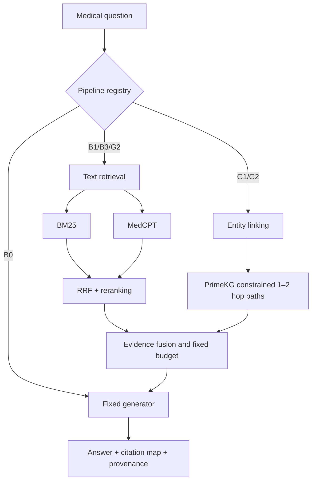
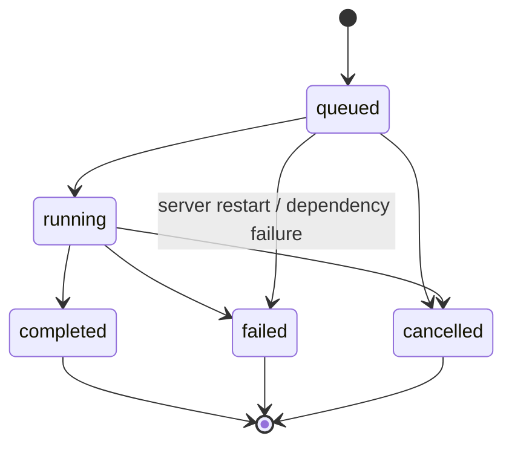

# Architecture diagrams

## Pipeline

```mermaid
flowchart TD
  Q[Medical question] --> R{Pipeline registry}
  R -->|B1/B3/G2| T[Text retrieval]
  R -->|G1/G2| L[Entity linking]
  T --> BM[BM25]
  T --> MC[MedCPT]
  BM --> F[RRF + reranking]
  MC --> F
  L --> P[PrimeKG constrained 1–2 hop paths]
  F --> E[Evidence fusion and fixed budget]
  P --> E
  R -->|B0| G[Fixed generator]
  E --> G
  G --> A[Answer + citation map + provenance]
```

## Request states

```mermaid
stateDiagram-v2
  [*] --> queued
  queued --> running
  queued --> cancelled
  running --> completed
  running --> failed
  running --> cancelled
  queued --> failed: server restart / dependency failure
  completed --> [*]
  failed --> [*]
  cancelled --> [*]
```

